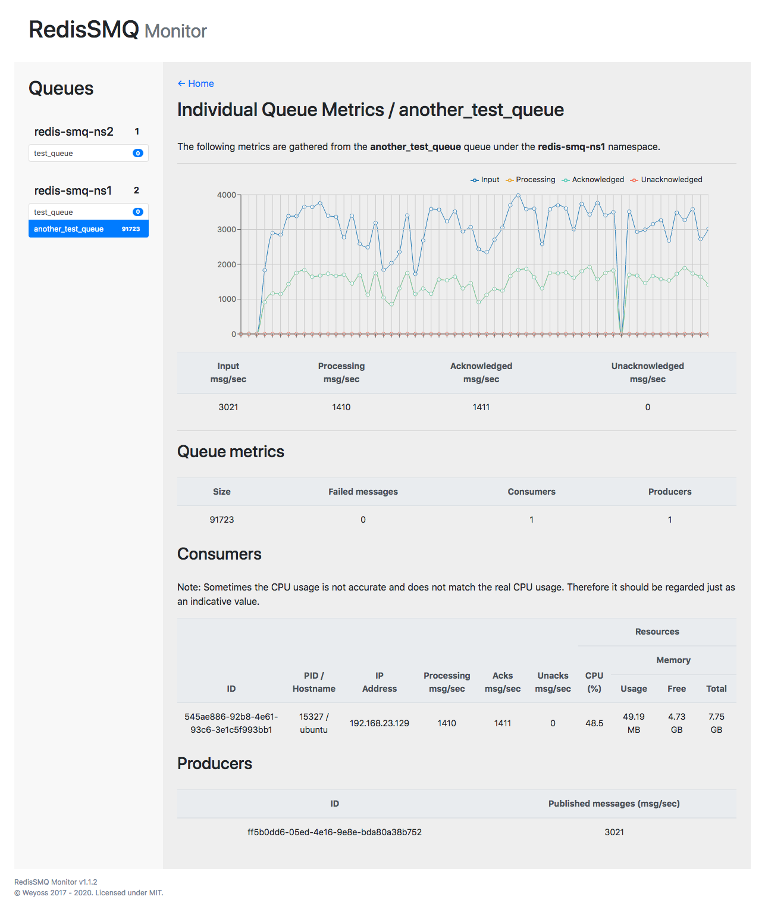

# RedisSMQ Monitor

The RedisSMQ Monitor is an interface which let you monitor and debug your 
[RedisSMQ message queue](https://github.com/weyoss/redis-smq) from a web browser in real-time.

Starting from version RedisSMQ v1.1.0, the monitor has split up into a standalone project and was packaged under
[RedisSMQ Monitor](https://github.com/weyoss/redis-smq-monitor)

RedisSMQ includes the monitor as part of its package. 

## Installation

Normally you should not care about installing this package separately from RedisSMQ. 

If you have RedisSMQ installed and running you can get the monitor out of box. 

But for any reason if you need to use this package without installing RedisSMQ then you can install it as follow:

```text
npm install redis-smq-monitor --save
```

# Configuration

RedisSMQ Monitor accepts the same configuration parameters as RedisSMQ. A configuration object may look like:

```javascript
'use strict';

const config = {
    redis: {
        driver: 'redis',
        options: {
            host: '127.0.0.1',
            port: 6379,
            connect_timeout: 3600000,
        }
    },
    monitor: {
        enabled: true,
        host: '127.0.0.1',
        port: 3000,
    },
};

modules.export = config;
```

The `config.redis` parameters should be provided to indicate to the monitor the redis driver to use and the 
Redis server to connect to. 

If not provided, by default the monitor will try to connect to localhost using `redis` driver.

Please referer to [RedisSMQ configuration](https://github.com/weyoss/redis-smq#configuration) for more details.

## Usage

```javascript
'use strict';

const config = require('./config');
const { monitor } = require('redis-smq'); 

// If installed separately from RedisSMQ
// const monitor = require('redis-smq-monitor'); 

monitor(config).listen(() => {
    console.log('It works!')
});
```

## Contributing

So you are interested in contributing to this project? Please see [CONTRIBUTING.md](https://github.com/weyoss/guidelines/blob/master/CONTRIBUTIONS.md).

## License

[MIT](https://github.com/weyoss/redis-smq/blob/master/LICENSE)